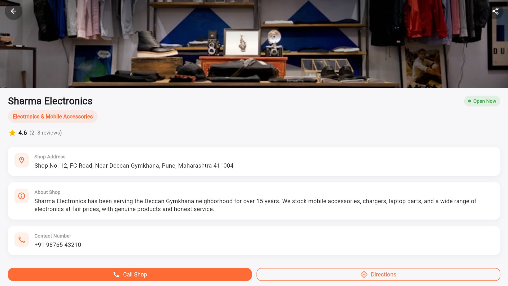
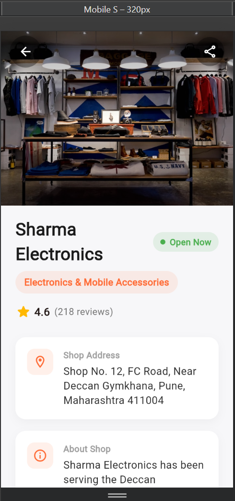
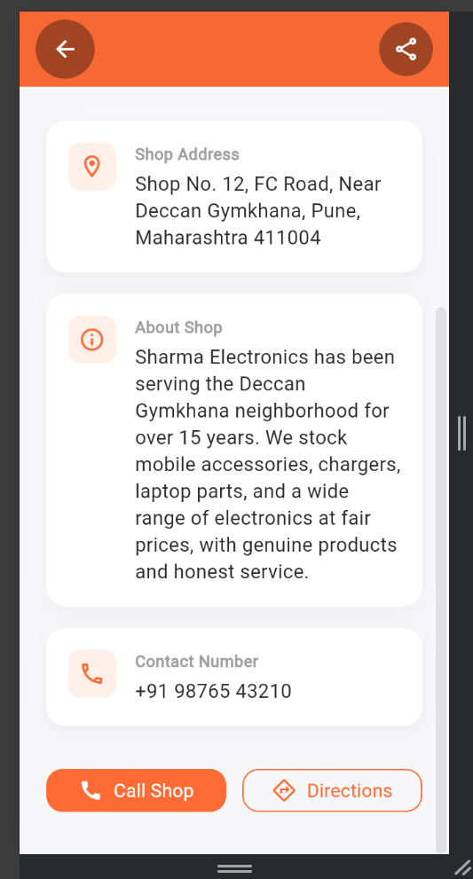

# vipto-shop-profile






A single Flutter screen - **Shop Profile Screen**

This is a UI-only implementation. There is no backend, API, Firebase,
authentication, or database - all data is hard-coded dummy data inside
`lib/shop_profile_screen.dart` (see the `ShopProfile` model and
`dummyShop` constant).

## Screen contents

- Shop profile image (network image with a graceful fallback icon)
- Shop name + an "Open Now / Closed" status badge
- Shop category
- Rating with review count
- Shop address
- About shop (short description)
- Contact number
- Call / Directions action buttons (UI only, not wired to real intents)

## Project structure

```
lib/
  main.dart                  # App entry point, theme setup
  shop_profile_screen.dart   # ShopProfile model, dummy data, and the screen UI
```

## Running the project

1. Make sure you have the latest stable [Flutter SDK](https://docs.flutter.dev/get-started/install) installed.
2. Install dependencies:
   ```bash
   flutter pub get
   ```
3. Run the app on your preferred platform:

   **To run on Web (Google Chrome):**
   ```bash
   flutter run -d chrome
   ```

   **To run as a Windows Desktop application:**
   ```bash
   flutter run -d windows
   ```

   **To run on a connected Android/iOS device or emulator:**
   ```bash
   flutter run
   ```
